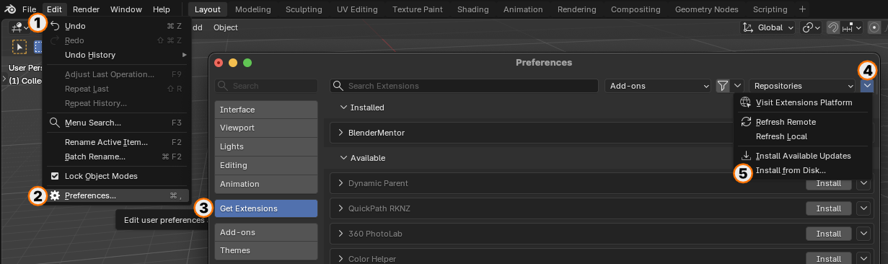
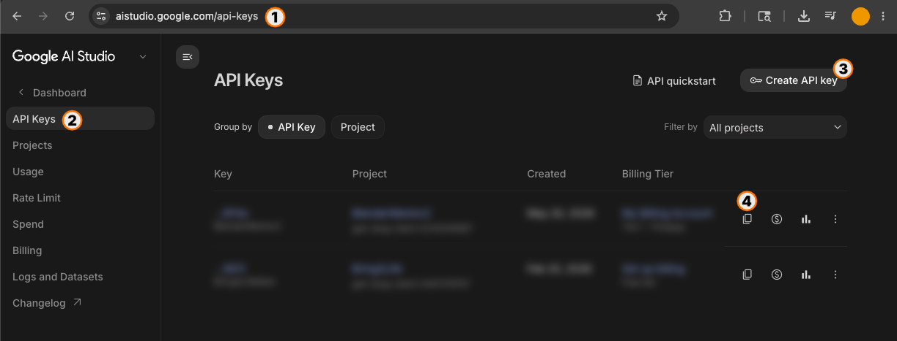
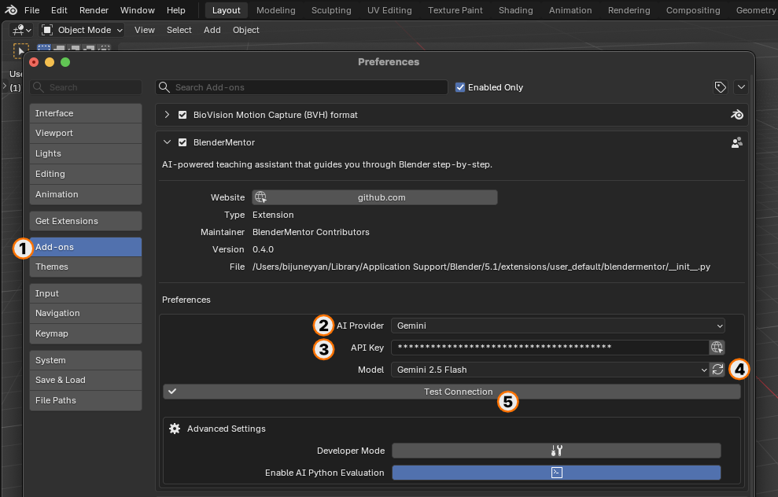
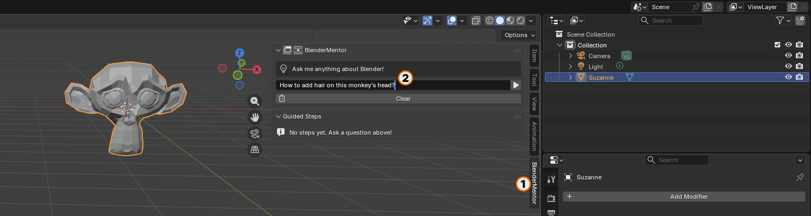
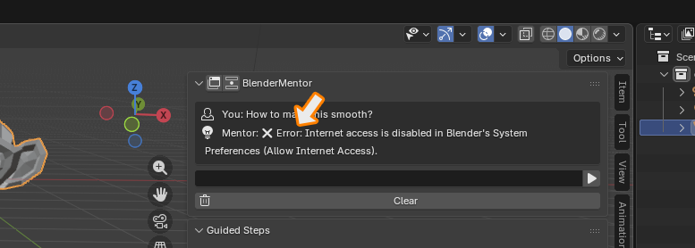
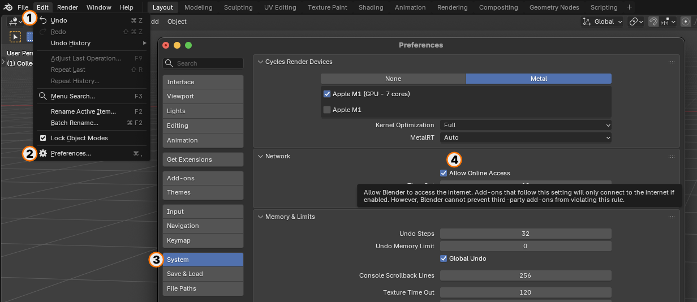
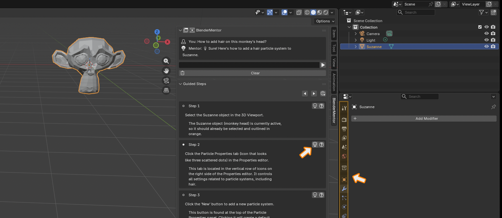

# 📖 BlenderMentor: Installation and Usage Instructions

Welcome to **BlenderMentor**! This guide provides comprehensive, step-by-step instructions on how to install, configure, and get the most out of your AI-powered teaching assistant directly inside Blender.

---

## 🚀 Part 1: Installation & Setup

BlenderMentor is fully compliant with the modern **Blender 4.2+ Extensions system**. Follow these steps to install and enable it.

### Step 1: Download the Add-on
*   Download the latest `blendermentor_addon.zip` package from our [Releases page](https://github.com/blendermentor/blendermentor/releases). 
*   *Note: Do not unzip the package; keep it as a `.zip` file.*

### Step 2: Access Blender Preferences
*   Launch Blender.
*   In the top-left menu bar, go to **Edit ➔ Preferences...**
*   A separate Preferences window will open.

### Step 3: Install the Add-on

*   On the left sidebar of the Preferences window, select the **Get Extensions** tab.
*   In the top-right header of the Preferences window, click the **cog/gear icon** to open the repository settings.
*   Select **Install from Disk...** from the dropdown menu.
*   Navigate to your downloads, select `blendermentor_addon.zip`, and click **Install**.
*   Blender will extract the extension, register it in your local `"User Default"` repository, and enable it automatically.

### Step 4: Generate your AI API Key (Google Gemini Example)

BlenderMentor runs locally and requires no registration on our end—you bring your own API keys. Google Gemini offers a highly accurate and generous free tier for developers:
*   Go to [Google AI Studio](https://aistudio.google.com).
*   Log in with your standard Google account.
*   Click the prominent **Get API Key** button in the top sidebar.
*   Click **Create API Key**, search for/select a project, and copy your newly generated key.

### Step 5: Configure the Add-on Preferences

*   Back in Blender Preferences, select the **Get Extensions** tab (or **Add-ons** tab).
*   Locate **BlenderMentor** and click the small arrow next to its name to expand the details and settings panel.
*   Set **AI Provider** to **Gemini**.
*   Paste your copied key into the **API Key** field (the key is hidden as a password field for security).
*   Click **Fetch Models** (the file folder refresh icon). BlenderMentor will connect to the API, retrieve the active list of Gemini models, and populate the dropdown.
*   Select your preferred model (e.g., `gemini-2.0-flash`).
*   Click **Test Connection** (the checkmark icon) to confirm the key is active and working. You will see a success message (`✓ Gemini connection successful!`).

---

## 🛠 Part 2: How to Use BlenderMentor

Once configured, BlenderMentor lives in your 3D Viewport sidebar and is ready to teach you.

### Step 1: Open the Chat Panel
*   Hover your mouse over the main **3D Viewport**.
*   Press **`N`** on your keyboard to open the Sidebar panel on the right.
*   Select the **BlenderMentor** tab.

### Step 2: Ask a Question

*   Type a question in the input field at the bottom of the panel (e.g., *"How do I add a subdiv modifier to my active mesh?"*).
*   Click the **Send** button (the Play icon) or press **Enter** to submit your query.

---

## 🌐 Troubleshooting: Internet Access Errors

Because Blender 4.2+ enforces strict system security, your addon might occasionally show an error banner when you try to submit a question:
> `⚠ Internet access is disabled in Blender's System Preferences (Allow Internet Access).`

### Why does this happen?
Blender has a global safety toggle designed to prevent extensions from connecting to the internet without your knowledge. BlenderMentor strictly respects this preference and will block all API calls if it is turned off.

### How to Fix It:

*   Go to **Edit ➔ Preferences...**
*   Select the **System** tab on the left sidebar.
*   Scroll down to the **Network** section.
*   Check the box to enable **Allow Internet Access**.
*   Close the preferences. You can now immediately send your questions successfully!

---

## 🎯 Part 3: Navigating Step-by-Step Guidance

When BlenderMentor responds, it won't just dump text in your face—it builds a structured learning path specifically for your scene.

### 1. Step-by-Step Response List
The panel renders a list of clear, single-action instructions. Click any step block directly to make it active.

### 2. UI Highlighting & the Lightbulb Icon (`'LIGHT'`)
*   Selecting a step automatically triggers a **visual colored outline** over the exact Blender editor, navigation tab, or button panel you need to interact with.
*   If the highlight fades or you need to see it again, click the **Lightbulb (`'LIGHT'`)** icon in the header of the active step to re-trigger the glow animation.

### 3. Asking Follow-Up Questions (`Ask ❓`)
*   If a specific step is confusing (e.g., you don't understand *why* you are adding a material, or a button is named differently on your screen), click the **Ask ❓** button right next to that step.
*   Type your question. The AI will receive the exact context of your current steps and answer your question directly in the chat, updating your guide seamlessly.

### 4. Searching YouTube Tutorials (`'URL'`)
*   Often, seeing a workflow in a video makes it click. If the AI detects a good fit for video learning, a **Globe (`'URL'`)** icon appears in the top navigation row.
*   Hover over the Globe to see the tooltip *"Search YouTube Tutorials"*.
*   Clicking it immediately opens your default browser with an AI-optimized search query focused exactly on your task, getting you high-quality video tutorials instantly.
